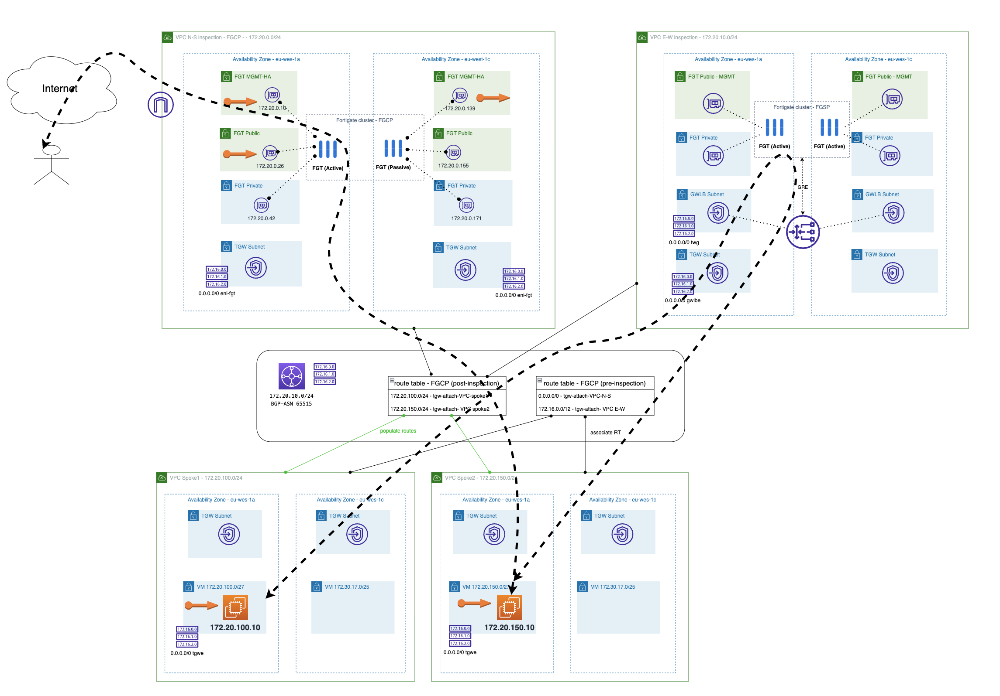

# N-S and E-W inspection with dedicated VPCs

This is an example of how to deploy fortigates using [ftnt-aws-modules](https://registry.terraform.io/modules/jmvigueras/ftnt-aws-modules/aws/latest)

## Deployment Overview

This Terraform code deploy the following elements:

- 1 VPC for N-S inspection with an Active-Passive Fortigate cluster (FGCP cluster).
- 1 VPC for E-W inspection with an Active-Active Fortigate cluster (FGSP cluster). 
- 1 AWS TGW with two route tables, pre and post inspection.
- 2 Spokes VPC with linux instances deployed for testing. 

## Diagram overview

## Requirements
* [Terraform](https://learn.hashicorp.com/terraform/getting-started/install.html) >= 1.5.0
* Check particulars requiriments for each deployment (AWS) 

## Deployment
* Clone the repository.
* Configure accesss secrets to access Azure in terraform.tfvars.example which is allocated in root folder. [terraform.tfvars.example](./terraform.tfvars.example).  And rename `terraform.tfvars.example` to `terraform.tfvars`.
* Change parameters in the variables.tf.
* If using SSO, uncomment the token variable in variables.tf and providers.tf
* Initialize the providers and modules in each individual deployment as is described in it README file.

# Support
This a personal repository with goal of testing and demo Fortinet solutions on the Cloud. No support is provided and must be used by your own responsability. Cloud Providers will charge for this deployments, please take it in count before proceed.

