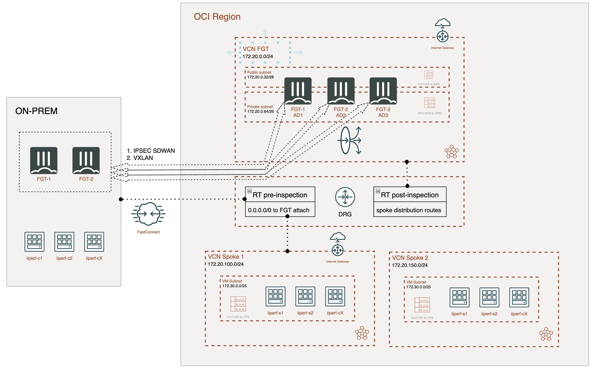
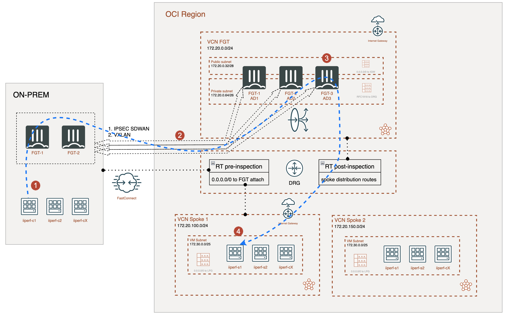
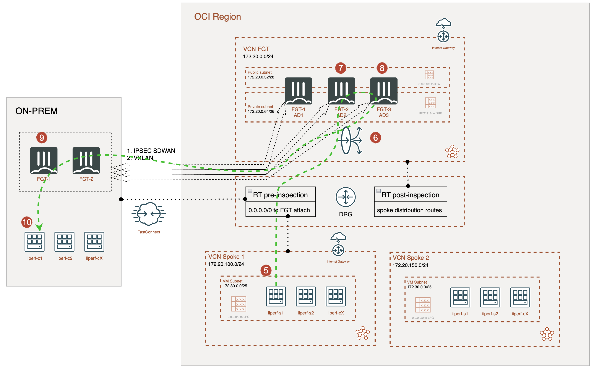

# Forigate cluster deployment

This deployment will create a Fortigate Cluster Active/Passive in two Availability Domains (AD1 and AD2) acting as an on-premises cluster. As well, additional FortiGate cluster Active/Active with 3 members (AD1, AD2 and AD3) will be deployed as backend of an OCI Network Load Balancer (NLB). Traffic between cluster is steering using a Dynamic Routing Gateway (DRG). With this scenario it is possible to simulate high throughput FastConnect connection and traffic control using VXLAN overlays with ECMP. 

## Deployment Overview

- VCN for simulated on-premises cluster and FortiGate Active/Pasive cluster. 
- VCN for FortiGate Active/Active cluster with three members and a NLB. 
- DRG to connect VCNs.
- VXLAN interface connecting both clusters on-premises and cloud.

> [!NOTE]
> This deployment is configured by default to deploy instances of 24 OCPUs for on-premises cluster and 16 OCPUs for Active/Active cluster in PAYG service model.  

## Setup Overview

**General view:**

**First packet sync flow from on-premises to cloud:**

**Response packet flow from cloud to on-premises:**

> [!IMPORTANT]
> If no SNAT at FortiGate level is used, it can happen that NLB sends traffic to FortiGate member that has not processed the initial packet from on-premises, so it is mandatory to setup a FGSP cluster with sync config between members. 

## Requirements
* [Terraform](https://learn.hashicorp.com/terraform/getting-started/install.html) >= 1.0.0
* Check particulars requiriments for each deployment (OCI) 

## Deployment
* Clone the repository.
* Configure accesss secrets to access OCI in terraform.tfvars.example which is allocated in root folder. [terraform.tfvars.example](./terraform.tfvars.example).  And rename `terraform.tfvars.example` to `terraform.tfvars`.
* Change parameters in the variables.tf.
* If using SSO, uncomment the token variable in variables.tf and providers.tf
* Initialize the providers and modules in each individual deployment as is described in it README file.

## Support
This a personal repository with goal of testing and demo Fortinet solutions on the Cloud. No support is provided and must be used by your own responsability. Cloud Providers will charge for this deployments, please take it in count before proceed.

