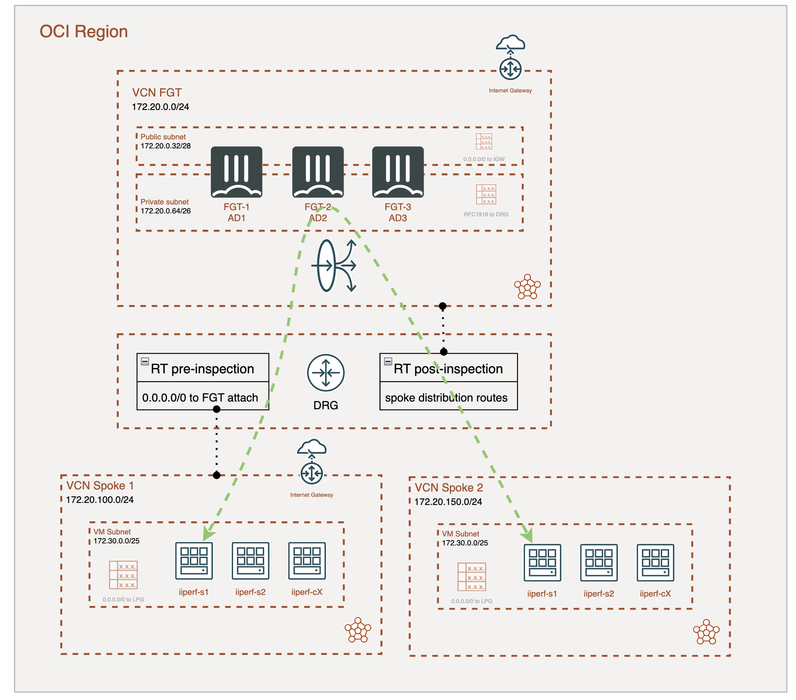

# Forigate cluster deployment

This deployment will create a FortiGate cluster Active/Active with 3 members (AD1, AD2 and AD3), that will be the back-end of an OCI Network Load Balancer (NLB). Traffic between spokes VCN is steering using a Dynamic Routing Gateway (DRG). This deployment is able to inspect inter VCN connections and VCN to on-premises. 

## Deployment Overview

- VCN for FortiGate Active/Active cluster with three members and a NLB. 
- DRG to connect VCNs.

> [!NOTE]
> This deployment is configured by default to deploy instances of 16 OCPUs for Active/Active cluster in PAYG service model.  

## Setup Overview

**General view:**

> [!NOTE]
> In this deployment it is not necessary to configure the FortiGate NLB backend as a FGSP cluster synchronizing sessions because NLB is able to do symmetric hashing of packets to stick sessions.

## Requirements
* [Terraform](https://learn.hashicorp.com/terraform/getting-started/install.html) >= 1.0.0
* Check particulars requiriments for each deployment (OCI) 

## Deployment
* Clone the repository.
* Configure accesss secrets to access OCI in terraform.tfvars.example which is allocated in root folder. [terraform.tfvars.example](./terraform.tfvars.example).  And rename `terraform.tfvars.example` to `terraform.tfvars`.
* Change parameters in the variables.tf.
* If using SSO, uncomment the token variable in variables.tf and providers.tf
* Initialize the providers and modules in each individual deployment as is described in it README file.

## Support
This a personal repository with goal of testing and demo Fortinet solutions on the Cloud. No support is provided and must be used by your own responsability. Cloud Providers will charge for this deployments, please take it in count before proceed.

